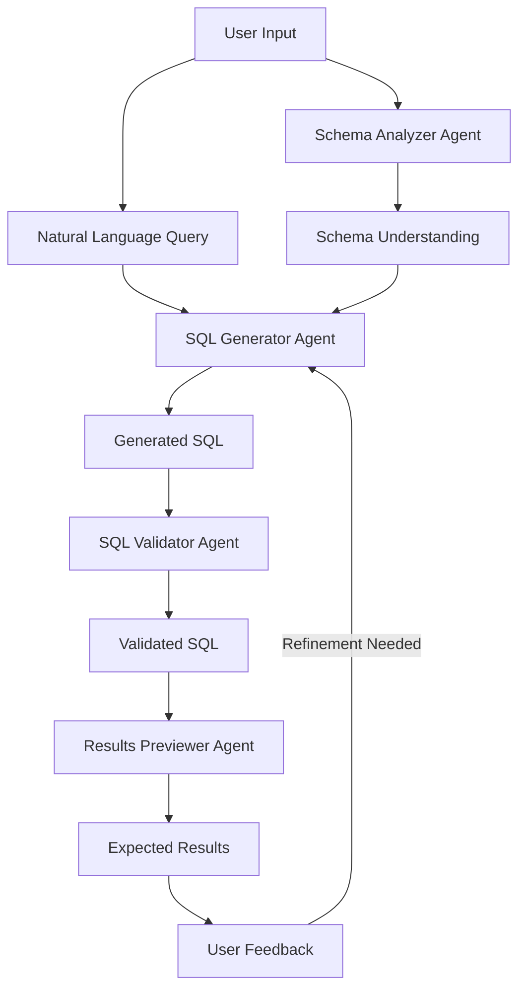

## 🔍 SQL Query Generator - Natural Language to SQL Conversion Tool

[](https://txt-to-sql-app.streamlit.app/)


Transform natural language into optimized SQL queries with this AI-powered tool. Perfect for database professionals, analysts, and developers who want to query databases without memorizing complex SQL syntax.

## 🌟 Key Features

- **Natural Language Processing**: Convert plain English questions into SQL queries
- **Schema-Aware Generation**: Understands your database structure for accurate query generation
- **Multi-Agent Validation**: Four specialized AI agents ensure query accuracy:
  - Schema Analyzer
  - SQL Generator
  - SQL Validator
  - Results Previewer
- **Iterative Refinement**: Automatically improves queries to better match your intent
- **Results Simulation**: Preview expected results with realistic sample data
- **Query History**: Track all your previous queries for reference

## 🚀 Quick Start

### Using the Web App

1. Visit the [live demo](https://txt-to-sql-app.streamlit.app/)
2. Input your database schema (paste or upload)
3. Click "Analyze Schema"
4. Describe your query in plain English
5. Click "Generate SQL"
6. Review and use the generated SQL

### Local Installation

```bash
# Clone the repository
git clone https://github.com/aabdullah27/Txt_to_SQL_Streamlit.git
cd 'TEXT TO SQL'

# Create and activate virtual environment (recommended)
python -m venv venv
source venv/bin/activate  # Linux/Mac
venv\Scripts\activate     # Windows

# Install dependencies
pip install -r requirements.txt

# Set up environment variables
echo "GOOGLE_API_KEY=your_api_key_here" > .env

# Run the application
streamlit run app.py
```

## 📚 Comprehensive Documentation

### Database Schema Input

The tool accepts database schemas in multiple formats:
- SQL CREATE TABLE statements
- Database documentation
- ER diagrams (textual description)
- Exported schema files

Example schema:
```sql
CREATE TABLE employees (
  emp_id INT PRIMARY KEY,
  name VARCHAR(100) NOT NULL,
  department VARCHAR(50),
  hire_date DATE,
  salary DECIMAL(10,2)
);

CREATE TABLE projects (
  project_id INT PRIMARY KEY,
  name VARCHAR(100),
  start_date DATE,
  end_date DATE,
  budget DECIMAL(12,2),
  manager_id INT REFERENCES employees(emp_id)
);
```

### Query Examples

| Natural Language Query | Generated SQL |
|------------------------|---------------|
| "Show me all employees in the Sales department earning more than $75,000" | `SELECT * FROM employees WHERE department = 'Sales' AND salary > 75000 ORDER BY salary DESC;` |
| "Find projects that are over budget" | `SELECT p.* FROM projects p WHERE p.budget < (SELECT SUM(...) FROM ...);` |
| "List employees who haven't been assigned to any projects" | `SELECT e.* FROM employees e LEFT JOIN project_assignments pa ON e.emp_id = pa.emp_id WHERE pa.emp_id IS NULL;` |

### Advanced Features

1. **Query Refinement**:
   - The tool automatically detects when generated SQL doesn't match user intent
   - Iteratively improves queries (up to 3 refinement cycles)
   - Provides explanations for each refinement

2. **Results Preview**:
   - Generates realistic sample data based on schema
   - Shows expected columns and row count
   - Highlights when results don't match user intent

3. **Schema Analysis**:
   - Identifies tables, columns, and relationships
   - Detects primary and foreign keys
   - Understands data types and constraints

## 🛠 Technical Architecture



## 📦 Dependencies

- Python 3.10+
- Streamlit (Web Interface)
- Pandas (Data Handling)
- Agno Agents (AI Framework)
- Google Gemini API (LLM Backend)

## 📝 License

This project is licensed under the MIT License - see the [LICENSE](LICENSE) file for details.

## 🤝 Contributing

We welcome contributions! Please follow these steps:

1. Fork the repository
2. Create your feature branch (`git checkout -b feature/AmazingFeature`)
3. Commit your changes (`git commit -m 'Add some AmazingFeature'`)
4. Push to the branch (`git push origin feature/AmazingFeature`)
5. Open a Pull Request

---

**Note**: This tool generates SQL queries based on AI interpretation of your schema and natural language input. Always verify critical queries before executing them on production databases.
